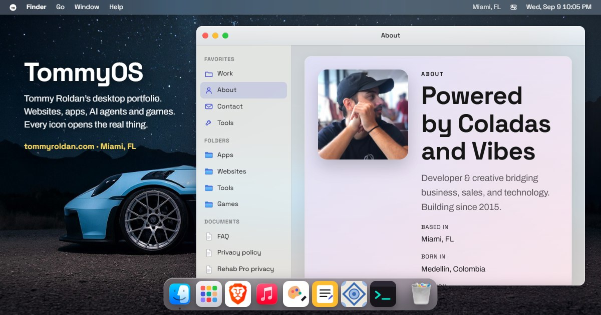

<div align="center">



# TommyOS

**Tommy Roldan's portfolio, presented as a desktop operating system.**

Websites, apps, e-commerce, AI agents and games.
Every icon opens the real thing.

[](https://tommyroldan.com)

[](https://github.com/TmasLove/Portfolio/actions/workflows/deploy.yml)
[](https://github.com/TmasLove/Portfolio/commits/master)
[](#run-it-locally)
[](#how-it-is-built)

</div>

---

## What it is

On a computer it is a Mac desktop: windows you can drag and stack, a dock,
Launchpad, Spotlight, Mission Control, Control Centre, Stickies, and a
right-click menu on the wallpaper. On a phone it becomes an iPhone home screen
with pages and widgets.

Every project is an app icon. Opening one gives you a case file with the live
site running inside it. Nothing is a screenshot of work, it is the work.

Two things it does that a portfolio usually does not:

- **The wallpaper is shared.** Change it and that is what the next visitor sees.
- **The wall is public.** Drawings from Paint and memes from Meme Maker are posted by whoever is visiting, and everyone sees them.

## Inside

| | |
| --- | --- |
| **Work** | Client sites, apps and platforms, each opening as its own window. |
| **Products** | [Canary](https://tommyroldan.com/canary/), a free Windows diagnostic tool, and [PPT Speech](https://tommyroldan.com/ppt-speech/), which reads a `.pptx` aloud entirely in the browser. |
| **Games** | Armagetron Advanced running in the browser, Brick Breaker from 2015, Meme Maker, and Paint, which contains Trace, a tracing game scored against the picture underneath. |
| **Everything else** | About, Work, Tools, FAQ and Contact are real windows and plain HTML routes at the same time, so they work with a URL, a search engine, or JavaScript off. |

## How it is built

Static HTML, CSS and JavaScript. No framework, no bundler, no build step, no
`node_modules`. The whole site is the `site/` folder, served exactly as it sits
on disk.

```
site/
  index.html      the desktop itself
  shell.js        window manager, dock, Launchpad, Spotlight, iPhone launcher
  extras.js       Control Centre, Notification Centre, Mission Control, tour, Stickies
  wall.js         the shared public wall (Paint drawings and memes)
  trace.js        Trace, the tracing game inside Paint
  notch.js        Codenotch, rebuilt: usage rings pinned to the screen edge
  work/           one folder per project, each a case file
  canary/         the Canary product page
  arena/          Armagetron Advanced, browser port
  assets/         icons, wallpapers, models, vendor code
```

The one moving part is the wall, which talks to a small Cloudflare Worker. When
it cannot be reached, drawings save on that device only and the UI says so.

## Run it locally

```bash
npm run preview
```

That is `python3 -m http.server 8080 --directory site`. Any static server works
just as well. There is nothing to install first.

## Deploy

Push to `master`. [The workflow](.github/workflows/deploy.yml) publishes `site/`
to the `gh-pages` branch, which is what `tommyroldan.com` serves. No build
runs, so what you see locally is exactly what ships.

## Credits

Armagetron Advanced is built on the open-source Armawebtron port, under its own
licence in [`site/arena/COPYING`](site/arena/COPYING). Codenotch's interface is
a port of [vinzdg/codenotch](https://github.com/vinzdg/codenotch) (MIT).

<div align="center">
<br>
<sub><b><a href="https://tommyroldan.com">tommyroldan.com</a></b> · Miami, FL · Building since 2015</sub>
</div>
